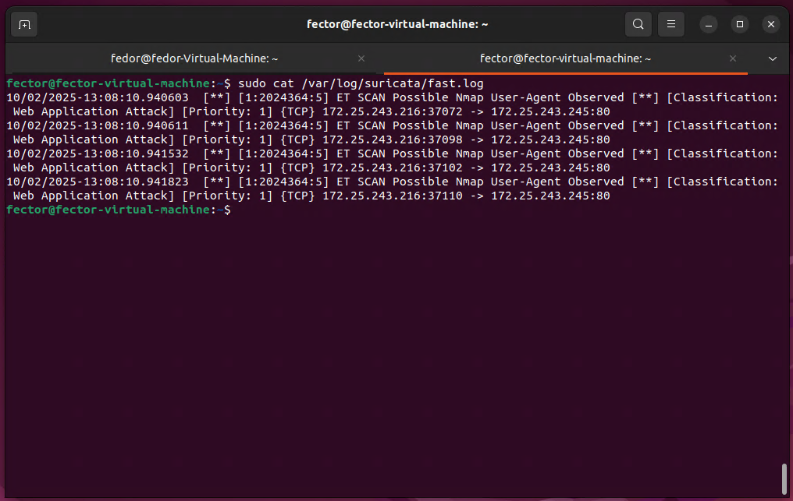
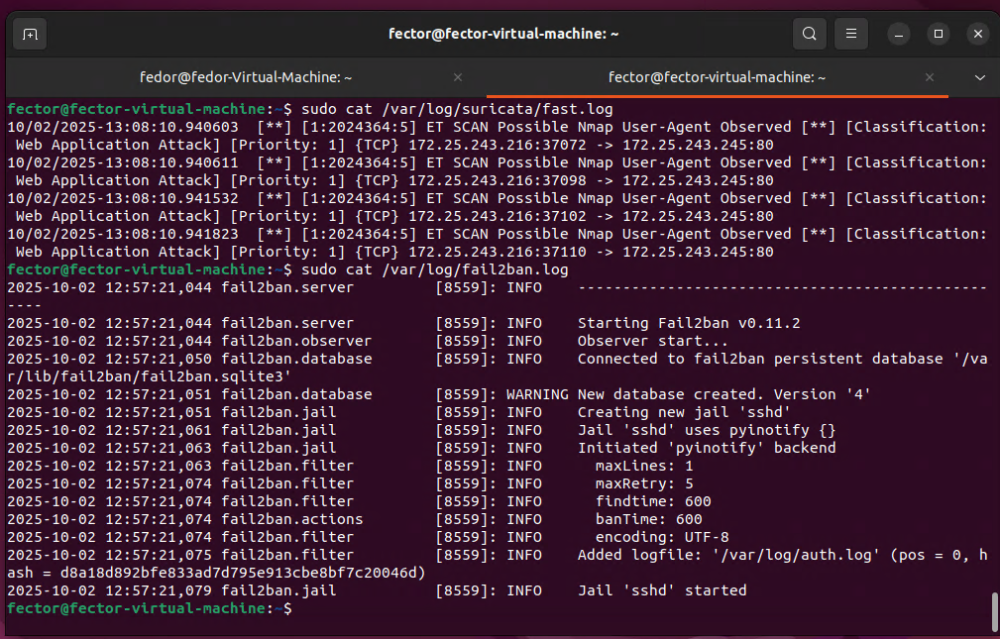
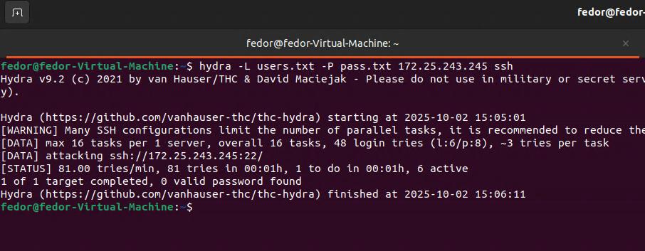
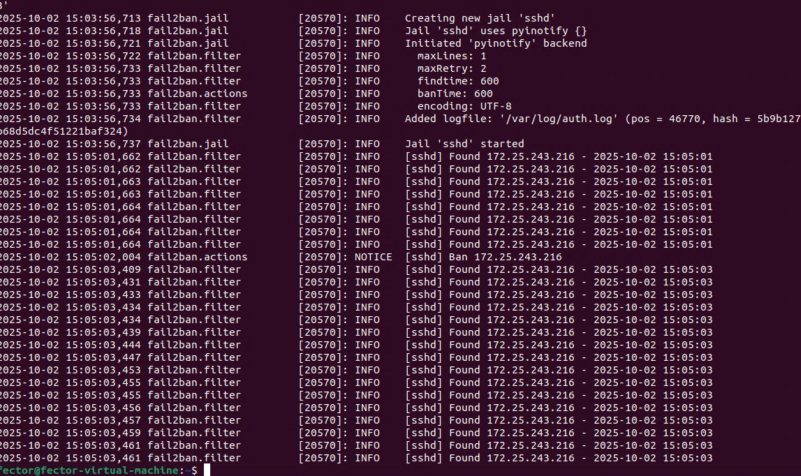
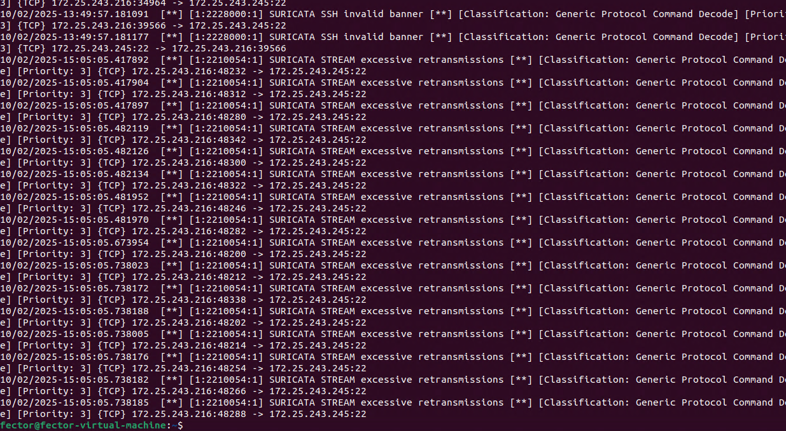

# Домашнее задание к занятию «Защита сети» - 

### Задание 1

Проведите разведку системы и определите, какие сетевые службы запущены на защищаемой системе:

**sudo nmap -sA < ip-адрес >**

**sudo nmap -sT < ip-адрес >**

**sudo nmap -sS < ip-адрес >**

**sudo nmap -sV < ip-адрес >**

По желанию можете поэкспериментировать с опциями: https://nmap.org/man/ru/man-briefoptions.html.


*В качестве ответа пришлите события, которые попали в логи Suricata и Fail2Ban, прокомментируйте результат.*

------

После выполнения сканирования портов с помощью Nmap, в файле /var/log/suricata/fast.log были зафиксированы следующие события:



Система обнаружения вторжений Suricata успешно идентифицировала и зарегистрировала попытку сетевой разведки. Сработавшее правило ET SCAN Possible Nmap User-Agent Observed указывает на то, что Suricata обнаружила характерный для сканера Nmap User-Agent при попытке запроса к веб-серверу на порту 80. Это подтверждает, что IDS корректно анализирует трафик и обнаруживает подозрительную активность на сетевом уровне.

Анализ лог-файла /var/log/fail2ban.log показал следующие записи:



Данные записи в логе Fail2Ban являются служебными и информируют о запуске сервиса, создании базы данных и активации "клетки" (jail) для службы SSH. В логах отсутствуют какие-либо записи об обнаружении атаки или блокировке IP-адресов. Это является ожидаемым поведением, поскольку Fail2Ban отслеживает неудачные попытки аутентификации в логах приложений, а сканирование портов таким событием не является. Следовательно, для Fail2Ban эта активность осталась незамеченной.


### Задание 2

Проведите атаку на подбор пароля для службы SSH:

**hydra -L users.txt -P pass.txt < ip-адрес > ssh**

1. Настройка **hydra**: 
 
 - создайте два файла: **users.txt** и **pass.txt**;
 - в каждой строчке первого файла должны быть имена пользователей, второго — пароли. В нашем случае это могут быть случайные строки, но ради эксперимента можете добавить имя и пароль существующего пользователя.

Дополнительная информация по **hydra**: https://kali.tools/?p=1847.

2. Включение защиты SSH для Fail2Ban:

-  открыть файл /etc/fail2ban/jail.conf,
-  найти секцию **ssh**,
-  установить **enabled**  в **true**.

Дополнительная информация по **Fail2Ban**:https://putty.org.ru/articles/fail2ban-ssh.html.


*В качестве ответа пришлите события, которые попали в логи Suricata и Fail2Ban, прокомментируйте результат.*


---

Была произведена атака на перебор паролей к службе SSH с помощью утилиты Hydra.




События в логах Fail2Ban
После запуска атаки в лог-файле /var/log/fail2ban.log были зафиксированы следующие ключевые события:

```text
2025-10-02 15:09:11,123 fail2ban.filter         [20875]: INFO    [sshd] Found 172.25.243.216 - 2025-10-02 15:09:11
2025-10-02 15:09:11,321 fail2ban.filter         [20875]: INFO    [sshd] Found 172.25.243.216 - 2025-10-02 15:09:11
2025-10-02 15:09:11,532 fail2ban.actions        [20875]: NOTICE  [sshd] Ban 172.25.243.216
```



Система предотвращения вторжений Fail2Ban успешно отразила атаку. 

Cистема обнаружения вторжений Suricata зафиксировала в файле /var/log/suricata/fast.log аномальную сетевую активность:

```text
10/02/2025-15:09:10.871891  [**] [1:2228000:1] SURICATA SSH invalid banner [**] [Classification: Generic Protocol Command Decode] [Priority: 3] {TCP} 172.25.243.216:40506 -> 172.25.243.245:22
```




Suricata, работая параллельно, также обнаружила атаку по ее характерным признакам на сетевом уровне. Сработавшее правило SURICATA SSH invalid banner указывает на некорректно сформированные SSH-сессии, типичные для инструментов вроде Hydra. Это подтверждает, что обе системы защиты сработали корректно, каждая на своем уровне: Suricata обнаружила, а Fail2Ban — активно заблокировал угрозу.